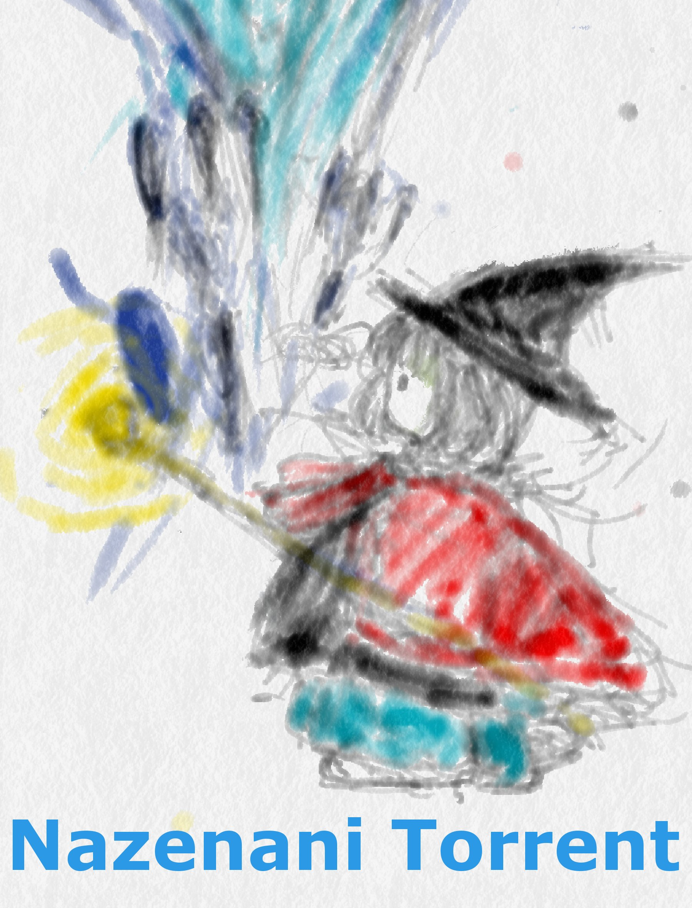

* [イントロ](intro/Intro.md)
   * [はじめに](intro/Introduction.md)
   * [Torrentとは](intro/About.md)
   * [ゴール](intro/Goal.md)
* [Torrentファイルを読み込む](torrentfile/Torrentfile.md)
   * [About](torrentfile/About.md)
   * [Bencodeの実装](torrentfile/Implementation.md)
   * [Bencode](torrentfile/Bencode.md)
   * [TorrentFileの中身](torrentfile/Content.md)
* [Httpサーバーを作成してみる](http/Http.md)
* [UPnpによるポートマップ](upnp/Upnp.md)
   * [UPnPによるポートマップ](upnp/About.md)
   * [UPnPの実装](upnp/Implementation.md)
* [Trackerへアクセスしてみる](tracker/Tracker.md)
   * [About](tracker/About.md)
   * [TrackerはHttpサーバ](tracker/Http.md)
   * [リクエストの中身](tracker/Request.md)
   * [レスポンスの中身](tracker/Response.md)
   * [テスト](tracker/Test.md)
* [ダウンロードゲームへ参加してみる](client/Client.md)
   * [About](client/About.md) 
   * [ダウンロードゲーム](client/DownloadGame.md)
   * [ブロックデーターの実装](client/BlockData.md)
   * [配信用、Peerを作成してみよう](client/Updater.md)
   * [基本戦術](client/BasicSs.md)
   * [Chokeの実装](client/ChokeImpl.md)
* [DHTに対応してみる](dht/Dht.md)
   * [Tracker無しでPeerを探す](dht/About.md)
   * [KademliaのkBucketを利用している](dht/kBucket.md)
   * [RootingTableを実装してみよう](dht/kBucketImpl.md)
   * [FindNodeでネットワークの構築](dht/FindNodes.md)
   * [FindNodeを実装](dht/FindNodesImpl.md)
   * [GetPeersでInfoHashに対応するPeerを探す](dht/GetPeers.md)
   * [テスト](dht/Test.md)
* PortMapテクニック

