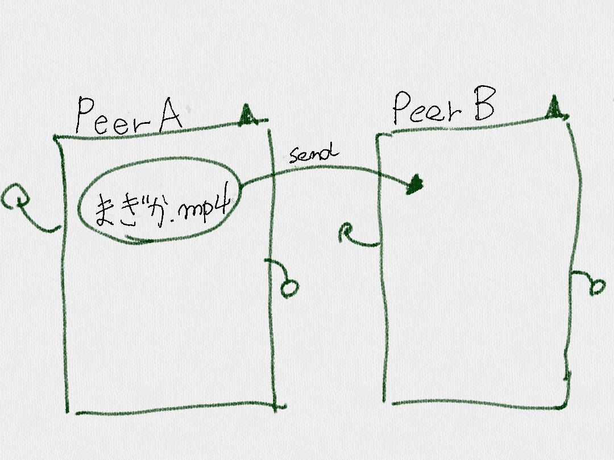
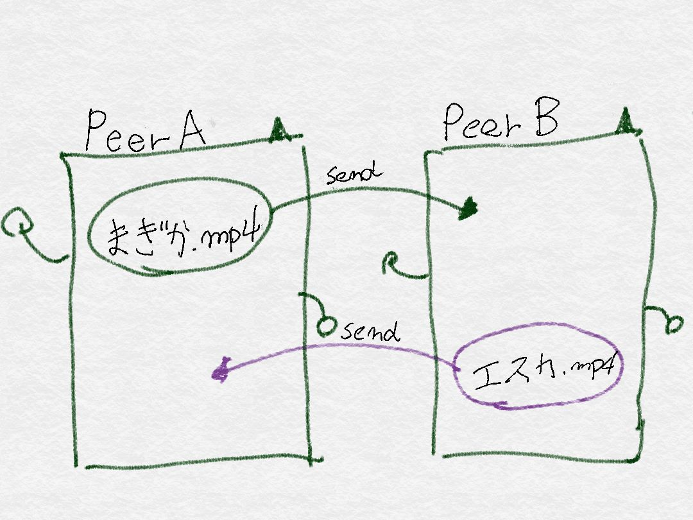
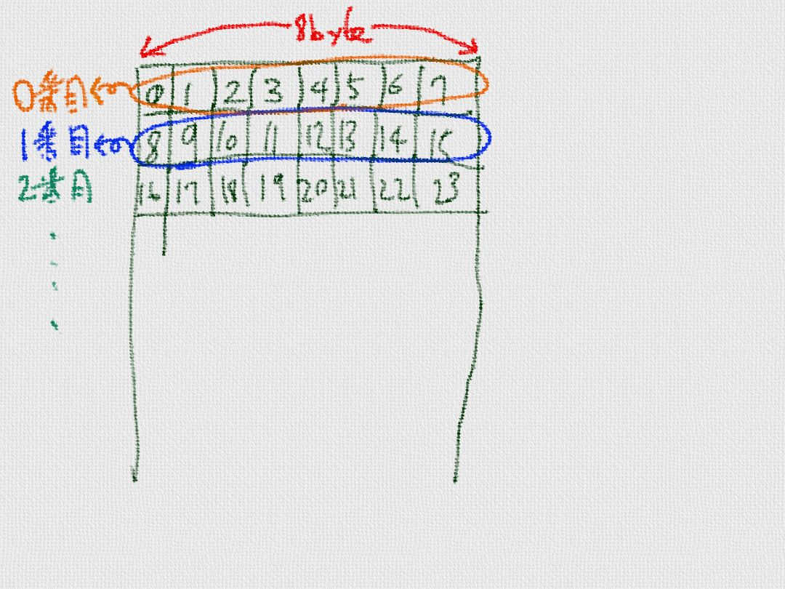

# ダウンロードゲーム

TrackerからPeerの一覧を取得できるようになりました。TorrentのP2Pネットワークから、実際にデーターをダウンロードしてみましょう。


## Torrentはデーターを配信しあう
Torrentでは、Peerどうしが所持してしいるデータを配信しあいます。

例えば、"まぎか.mp4" というデータをPeer A が所持していて、Peer B が このデータを欲しい場合



Peer A が Peer Bにデーターを提供します。


同様に、Peer B が Peer A が欲しがるデータを所持していた場合、

"まぎか.mp4"をダウンロードしながら、"エスカ.mp4"を配信します。


## Torrentはプロック単位で配信しあう

Torrent の場合は、このデータを共有する単位は、ファイル単位ではなくて、ブロック単位で管理しています。


```
{
 "announce":http://example.com/tracker,
 "created by":torrent generator,
 "creation date":1364723642,
 "encoding":utf-8,
 "info":{
 "length":1024,
 "name":xxx
 "piece length":16384,
 "pieces":<......20バイト単位のバイナリデータ>
 }
}
```

上記のような、TorrentFile の中に記載されている、"piece length" の単位でデータを分割しています。

例えば、piece_lengthが8で、[0,1,2,3,4,5,........]というデータを持つ場合、

といった感じで、n個に分割します。


## 効率よくデータを配信するほうほうを模索する。
効率よくデータをネットワーク全体に配信するために、Torrent Clientは様々な工夫を凝らします。

#### 1. 同時に、複数のPeerからダウンロードする
同時に、複数のpeerからデーターをダウンろロードします。これによって、いって時間にダウンロードできるデーター量が安定します。あるPeerの回線が混雑して遅くなっても、他の回線が早いpeerがその分をおぎなってくれます。

上がり速度よりも、下がり速度の方が早い回線がほとんどです。同時に複数のPeerからデータをダウウンロードすることで、下り速度いっぱいをり利用してダウンロードすることも可能です。


#### 2. ダウンロード速度が早いところからダウンロードする。

ダウンロード速度は、回線の速度、混み具合、経路などによって、変化していきます。
Torrent Client は、通信状態を計測してして、アップロード速度が早いpeerからデーターをダウンロードするようにします。

Torrent Client で良く使われ方法として、同時にダウンロードするPeer数をK個に固定して、一定時間ごとに、アップロード速度がお遅かった、peerを、それ以外のダウンロード可能なpeerと入れ替えます。


これによって、ダウンロード速度が早いK個のpeerを探しつつ、現状で最適なPeerかたデーターをダウンロードできるようになりますようになります。


#### 3. 配信しないTorrentには配信しない


# 配信専用のPeerを作成してみよう
## 最初の通信
* TCPでデータのやりとりをする
* 最初にHandshakeする
<br>
* 次にBitfieldする
<hr>


## 配信する側
* Notinterestedメッセージ で欲しいデータがない事を通知する
* Interestedメッセージを受け取る
* Unchokeメッセージ でダウンロードできる事を通知する
* Chokeメッセージ でダウンロードできない事を通知する


# 


