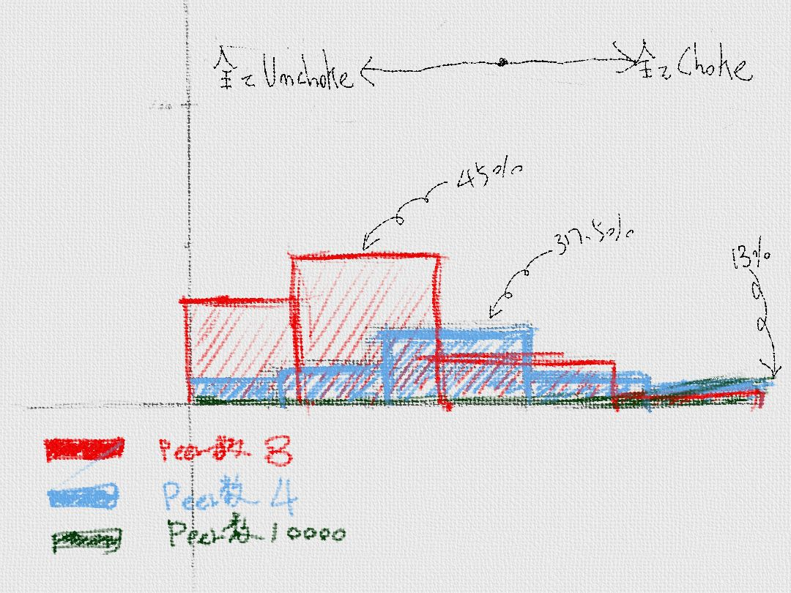

# 基本戦術
* 10個のメッセージを利用する
* Choke を利用してアップロード数を制限
* 配信に協力しないPeerをChokeする


<hr>

### 10個のメッセージを利用する

| メッセージ名|送信側から |受信側から|
| -- | -- |
| KeepAlive | 通信可能かチェック |得になし|
| Choke | アップロード不許可 |ダウンロード不許可|
| Unchoke | アップロード許可 |ダウンロード許可|
| Interest | ダウンロード許可要求 |アップロード許可要求|
| NotInterest | ダウンード許可不要 |アップロード許可不要|
| Request | ダウンロード要求 |アップロード要求|
| Cancel | ダウンロード要求破棄 | アップロード要求破棄 |
| Piece | データアップロード |データダウンロード|
| Bitfield | 所持しているBlockを知らせる|　　|
| Have | 所持しているBlockを知らせる |　　|

これらのメッセージをやりとりして、データの配信とダウンロードを行います。
ネットワーク全体に効率良くデーターが配信されると同時に、すばやく、データをダウンロードできる環境が望ましいです。

ダウンロードする側としては、Unchokeメッセージを送信してもらいたい。配信する側としては、限られた数のPeer以外はUnchokeメッセージを送信したくない。といった感じでしょうか。


### Choke を利用してアップロード数を制限

Choke機能を利用してアップロードを制限しましょう。アップロードする側の戦略としては、なるたけ、回線速度の良いPeerへたくさんデータを配信することです。

太い回線のPeerが配信に参加した方が、効率良くデータ配布できますから、合理的な判断です。

##### 回線の太いPeerへ優先して配信する。
もっとも太い回線をもっているPeerと通信し続けるのが良いでしょう。
しかし、もっとも太い回線を持っているPeerを知らないわけですから、
良い選択をしているか判断できません。

そこで、回線の太いPeerへのアップロードをしつつ、回線の太いPeerを探す事を行います。

例えば、
1. 5個のUnchoke中のPeerの中で、もっとも回線が細いPeerには、Chokeメッセージを送信する
2. Choke中のPeerからランダムにひとつのPeerを選択して、Unchokeメッセージを送信する。
3. これを、30ごとに繰り返す。

回線の速度は、30秒間の間に実際にアップロードしたバイト数とかで判断します。
この方法をとる事で、他にも良い効果があります。

* A. 回線の細いPeerへもデータを配布できる。
* B. 同時にアップロードする量を調整できる。この例だと5個
* C.  回線の太いPeerへの配信よりも、アップロードして欲しいデータが減ると、ダウンロード速度が落ちたと判断される。

特にCの特徴が重要です。後述する方法と組み合わせる事で、自ら積極的に配信に協力しないと、素早くデータをダウンロードできないといった特徴を持たせる事ができます。


以上で終了ですが、最適な選択を選ぶ方法としては、「A/Bテスト」、「バンディットアルゴリズム」とかでググってみてください。


### 配信に協力しないPeerをChokeする
　データをダウンロードはするけど、配信しないPeerに対して、対策が必要です。しかし、あるPeerが協力的なのか、非協力的なのかを判断する方法はおおくありません。
　

　
　例えば、ダウンロードして欲しいデータを持っているPeerがあったとします。そのPeerへたくさんアップロードしているのに、Chokeされたままという場合を考えてみましょう。この、Peerは協力的でない可能性があります。なので、このようなPeerはChokeしてアップロードを停止します。
　


### 確率的に、2〜3のPeerからUnchokeされる

Chokeをする事によって、具体的にどうのような事が起きているのかを確率的に見てみましょう。

##### (peer数が3の場合)

3つのPeerのネットワークで、各々のPeerは、2つがUnchokeする場合について見てみましよう。

あるPeerがChoke,Uncokeを受けるパターンは以上のとおり、8パターンあります。
これに、Chokeされる確率は1/3であることを考慮すると。


| Chokeの数| パターン| 確率|
| -- | -- | -- |
| 無し | ooo | 2/3 x 2/3 x 2/3 x 1 == 30% |
| ひとつ | xoo,oxo,oox | 1/3 x 2/3 x 2/3 x 3 == 45% |
| ふたつ | oxx,xox,xxo,| 1/3 x 1/3 x 2/3 x 3 == 22% |
| 全部 | xxx | 1/3 x 1/3 x 1/3 x 1 == 3%|


##### (peer数が4の場合)

| Chokeの数| パターン| 確率|
| -- | -- | -- |
| 無し | oooo | 2/4 x 2/4 x 2/4 x 2/4 x 1 == 6.25% |
| ひとつ | xooo,oxoo,ooxo, ooox | 2/4 x 2/4 x 2/4 x 2/4 x 4  == 25% |
| ふたつ | xxoo,xoxo,xoox, oxxo, oxox, ooxx| 2/4 x 2/4 x 2/4 x 2/4 x 6 == 37.5% |
| みっつ | oxxxx,xoxx,xxox, xxxo | 2/4 x 2/4 x 2/4 x 2/4 x 4 == 25% |
| 全部 | xxxx | 2/4 x 2/4 x 2/4 x 2/4 x 1 == 6.25%|


##### (peer数が1000の場合)

1000個のPeerについても検証してみましょう。1000個あると書き出すのがきつくなります。
数式に落として考えて見ましょう。

```,ath

f(x) = \int_{-\infty}^\infty
    \hat f(\xi)\,e^{2 \pi i \xi x}
    \,d\xi

```

|unchokeの数||
| -- | -- |
|0|13.5%|
|1|27.0%|
|2|27.0%|
|3|18.0%|
|4|9.0%|
|5|3.6%|
|6|1.1%|

二項分布

##### 表に直すと以下のような感じになります。

 


### 回線速度、Peer数に応じて、Peerへダウンロード要求する

実際には、Seeder化したPeerへはunchokeする必要はないので、not seeder / seeder くらいの数のPeerからUnchokeされる事になります。

場合によっては、20-30のPeerからUnchokeされることになります。どのSeederを選ぶのがより良い選択なのかするこてで、効率的にダウンロードすることができるようになります。

#### 帯域をコントロールする。
ダウンロードする


