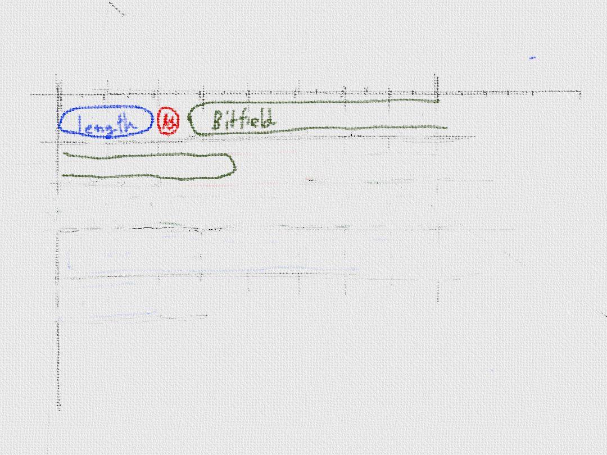
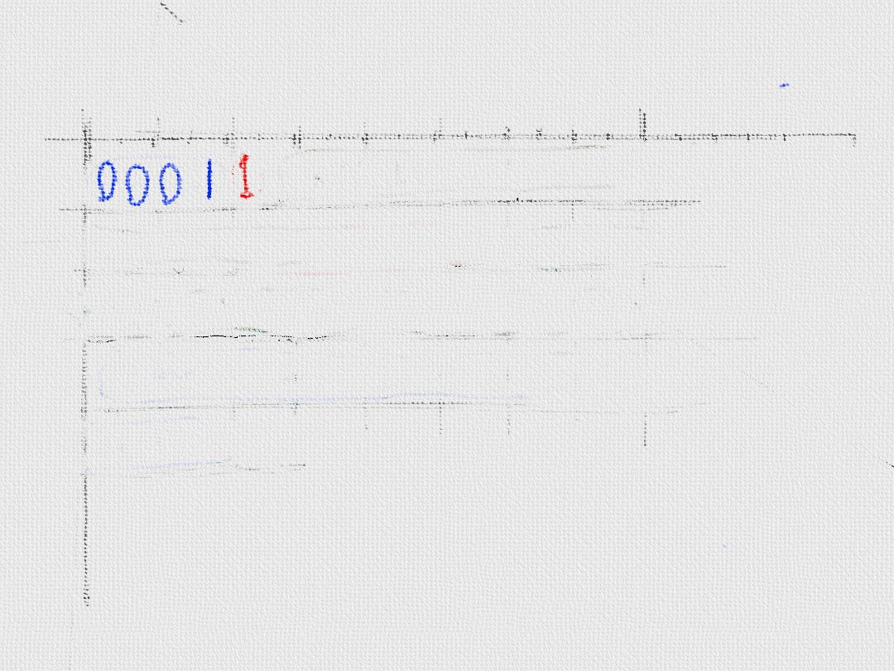
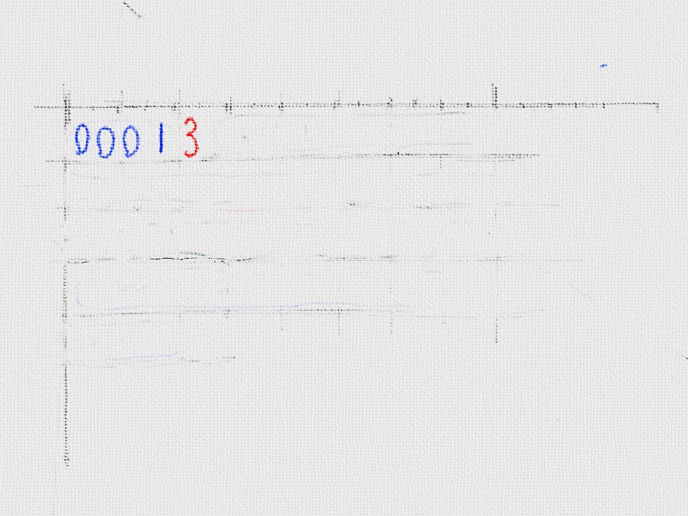
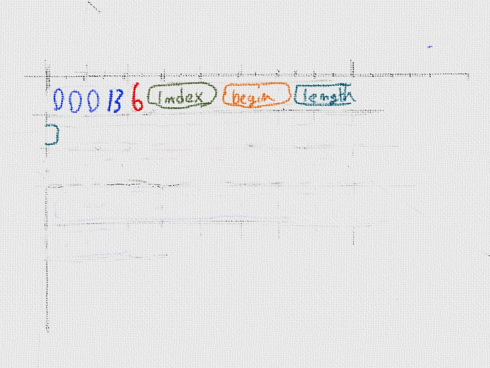
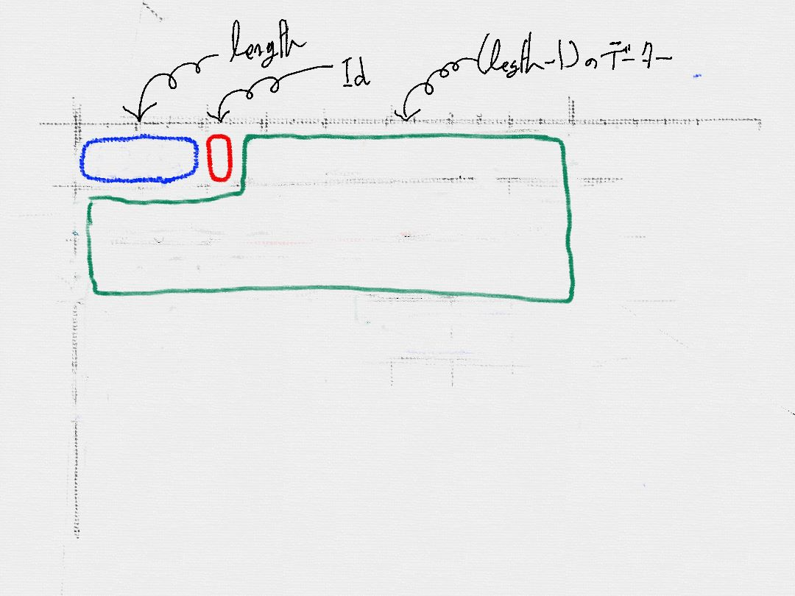

# 配信専用のPeerを作成してみよう
* Handshakeする
* ダウンロード許可を与える
* リクエストされたらデータをアップロードする

##### 駆け引きのないAIから作成してみよう
実際にデータ配信用のPeerを作成してみましょう。ただし、初めから、ダウンロードゲームで良い結果を生むAIを作成するのは難しいです。
まずは、簡単なところから手をつけていきましょう。

データを配信するだけのTorrent Clientを作成してみましょう。　駆け引きとかはありません。データの配信リクエストを受けとったら、その指示通りデータを配信するといったものを作成していきたいと思います。

##### ダウンロードゲームへ参加方法を学習しよう

　実際に実装してみて、ダウンロードゲームに参加してみましょう。実際に実装してみて、その振る舞いを観察してみましょう。
　メッセージがどのように使われているか?仕様の認識が間違っていないか? などを把握する事ができます。

## まずば、HandShakeする。
まずは、ハンドシェイク処理を行います。Torrent Clientがサポートしているプロトコルは何か?このセッションでやりとりするデータは何かを交換します。

中身はこんな感じ。

19はプロトコル名の長さ、"Bittorrent protocol"がプロトコル。
reserved は、拡張用に予約されている領域。infohash の部分がtorrent file を識別するのに使用するID。peer_id がpeerを識別するIDです。

Trackerから、IPアドレスとPort番号を教えてもらうと、Torrent Clientは、このメッセージを送信します。
InfoHashを検証して、回線に余裕があれば、相手からもこのメッセージが送信されます。

これで、ハンドシェークの完了です。

## 所持しているBlockを相手に伝える。
次に所持しているデーターを相手に伝えます。

length がメッセージの長さ。5 がメッセージを識別するID。Bitfieldはlength-1バイトの大きさを持つBitfieldデータ。

## 相手にダウンロードする許可を与える。
次に、相手にダウンロードする許可を与えます。unchokedメッセージを渡します。

0001がメッセージ長で、1がunchokeを示すIDです。

## データのダウンロードに興味がないことを伝える
配信専用なので、通信相手からデータをダウンロードする趣旨がないことを伝えておきましょう。

0001がメッセージ長で、3がnotintersted、エッセージである事を示すIDです。

## データを配信する
Torrent Clientでは、配信リクエストを受けたBlockを配信します。れクエストがない状態でデーターを配信することはありません。

Requestメッセージが相手から送られます。

indexが、Blockの位置、beginとlengthがアップロードして欲しい、開始位置、その長さです。

だいたい、16*1024 byteの単位でレクエストしてきます。

Pieceメッセージを返します。

## その他のメッセージ
これで、データ配信で利用するメッセージは網羅しました。他にもいくつか紹介できていないメッセージかるあるので紹介します。

#### メッセージの構造
HandShake以外のメッセージは、決まった構造をしている事にお気づきでしょうか?

こんな感じです。最初の4バイトが、メッセージの長さです。次にIDが渡されます。そして、メッセージの中身が渡されます。

| メッセージ名|Length|ID|内容|
| -- | -- |
| KeepAlive | 0 | なし |通信可能かチェック |
| Choke | アップロード不許可 |ダウンロード不許可|
| Unchoke | アップロード許可 |ダウンロード許可|
| Interest | ダウンロード許可要求 |アップロード許可要求|
| NotInterest | ダウンード許可不要 |アップロード許可不要|
| Request | ダウンロード要求 |アップロード要求|
| Cancel | ダウンロード要求破棄 | アップロード要求破棄 |
| Piece | データアップロード |データダウンロード|
| Bitfield | 所持しているBlockを知らせる|　　|
| Have | 所持しているBlockを知らせる |　　|

