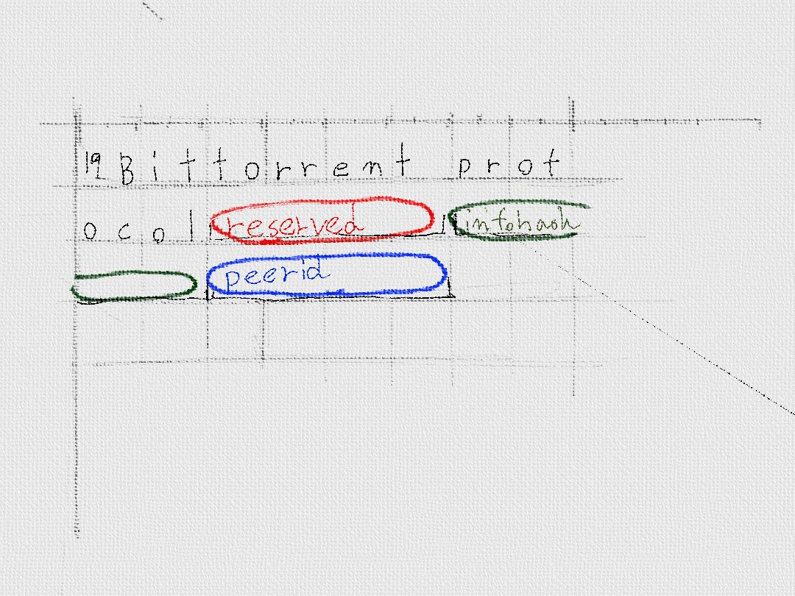

# 配信専用のPeerを作成してみよう
* TCPサーバーを立ち上げる。

実際にデータ配信用のPeerを作成してみましょう。ただし、賢くデータを配信すると行った事を最初から試そうとするのは難しいので、簡単なところから手をつけていきましょう。

データの配信リクエストを受けとったら、その指示通りデータを配信するまでを作成していきたいと思います。

## ますば、HandShakeする。
まずは、ハンドシェイク処理を行います。Torrent Clientがサポートしているプロトコルは何か?このセッションでやりとりするデータは何かを交換します。

中身はこんな感じ。

19はプロトコル名の長さ、"Bittorrent protocol"がプロトコル。
reserved は、拡張用に予約されている領域。infohash の部分がtorrent file を識別するのに使用するID。peer_id がpeerを識別するIDです。

Trackerから、IPアドレスとPort番号を教えてもらうと、Torrent Clientは、このメッセージを送信します。
InfoHashを検証して、回線に余裕があれば、相手からもこのメッセージが送信されます。

これで、ハンドシェークの完了です。

## データ配信に必要なメッセージ

* handshake
* 
* 
* 

## 相手にダウンロードしてきて良い事を伝える

* a
* b
* c

## 最初の通信
* TCPでデータのやりとりをする
* 最初にHandshakeする
 
* 次にBitfieldする

## 配信する側
* Notinterestedメッセージ で欲しいデータがない事を通知する
* Interestedメッセージを受け取る
* Unchokeメッセージ でダウンロードできる事を通知する
* Chokeメッセージ でダウンロードできない事を通知する

